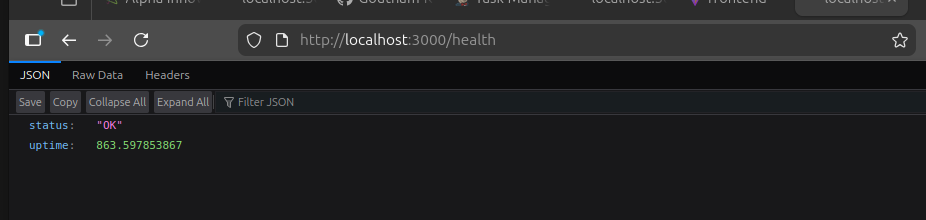
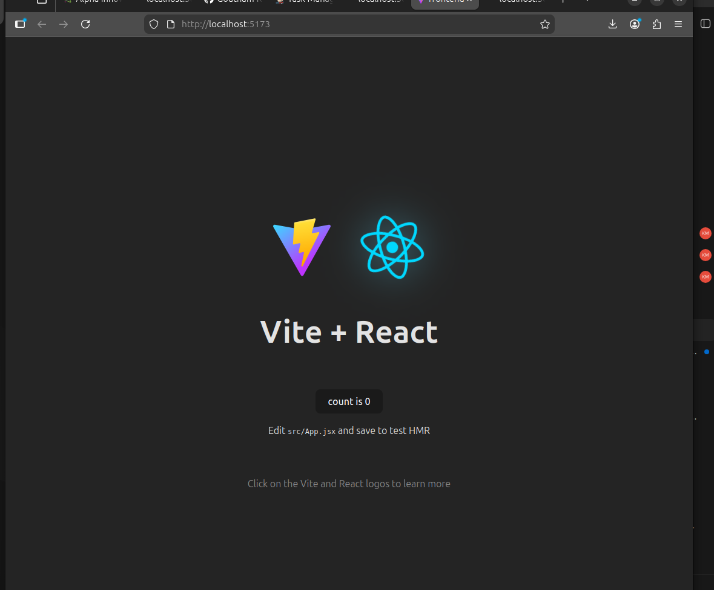

# 🚀 DevOps Project 2 – CI/CD Pipeline using Jenkins & Docker

## 📌 Project Overview

This project demonstrates a complete CI/CD Pipeline implementation using:

- Jenkins (Automation Server)
- Docker (Containerization Platform)
- DockerHub (Image Registry)
- GitHub (Source Code Management)

The goal of this project is to automate:

1. Cloning source code from GitHub  
2. Building a Docker image  
3. Pushing the image to DockerHub  
4. Deploying the containerized application  

---

## 🏗️ Architecture Workflow

```
Developer → GitHub → Jenkins → Docker Build → DockerHub → Deploy Container
```

---

## 🛠️ Technologies Used

- Jenkins  
- Docker  
- DockerHub  
- GitHub  
- Node.js (Task Manager Application)  

---

# ⚙️ Project Implementation Steps

---

## Step 1️⃣ – Run Jenkins using Docker

```bash
docker run -d \
  -p 8080:8080 \
  -p 50000:50000 \
  --name jenkins \
  jenkins/jenkins:lts
```

### Explanation
- Runs Jenkins inside a Docker container  
- Exposes port 8080 for Jenkins Web UI  
- Exposes port 50000 for agent communication  

Access Jenkins at:

```
http://localhost:8080
```

---

## Step 2️⃣ – Unlock Jenkins

```bash
docker exec jenkins cat /var/jenkins_home/secrets/initialAdminPassword
```

Copy the generated password and paste it into the Jenkins UI to unlock.

Install suggested plugins and create an admin user.

---

## Step 3️⃣ – Install Required Plugins

Install the following plugins inside Jenkins:

- Git Plugin  
- Docker Plugin  
- Pipeline Plugin  

---

## Step 4️⃣ – Connect GitHub Repository

Repository URL:

```
https://github.com/Goutham-K-278/DevOps-Project2.git
```

Jenkins pulls source code automatically from this repository.

---

## Step 5️⃣ – Create Jenkins Pipeline

Create a new Pipeline Job and add the following script:

```groovy
pipeline {
    agent any

    stages {

        stage('Clone Repository') {
            steps {
                git 'https://github.com/Goutham-K-278/DevOps-Project2.git'
            }
        }

        stage('Build Docker Image') {
            steps {
                sh 'docker build -t goutham02272006/task-manager-ci-cd:1 .'
            }
        }

        stage('Push to DockerHub') {
            steps {
                withCredentials([usernamePassword(credentialsId: 'dockerhub', usernameVariable: 'USERNAME', passwordVariable: 'PASSWORD')]) {
                    sh 'docker login -u $USERNAME -p $PASSWORD'
                    sh 'docker push goutham02272006/task-manager-ci-cd:1'
                }
            }
        }
    }
}
```

---

# 🐳 Docker Commands Used

## Build Docker Image

```bash
docker build -t goutham02272006/task-manager-ci-cd:1 .
```

## Push Docker Image

```bash
docker push goutham02272006/task-manager-ci-cd:1
```

## Run the Container

```bash
docker run -d -p 3000:3000 goutham02272006/task-manager-ci-cd:1
```

Application runs at:

```
http://localhost:3000
```

---

# 🔐 Jenkins Credentials Configuration

- DockerHub credentials stored securely inside Jenkins  
- Used `withCredentials` block in Pipeline  
- Prevents exposing username and password in the script  

---

# 🔁 Complete CI/CD Flow

1. Developer pushes code to GitHub  
2. Jenkins detects changes  
3. Jenkins clones repository  
4. Jenkins builds Docker image  
5. Image pushed to DockerHub  
6. Container deployed automatically  

---

# 📸 Screenshots

## ✅ Jenkins Pipeline Result



---

## ✅ Application Running Output



---

# 🎯 Key Learning Outcomes

- Understanding CI/CD concepts  
- Automating builds using Jenkins  
- Containerizing applications using Docker  
- Secure credential management  
- Real-world DevOps workflow implementation  

---

# 🚀 Conclusion

This project successfully demonstrates a complete DevOps CI/CD pipeline integrating GitHub, Jenkins, Docker, and DockerHub.

It automates the build and deployment lifecycle of a containerized application and reflects real-world DevOps practices used in the industry.
